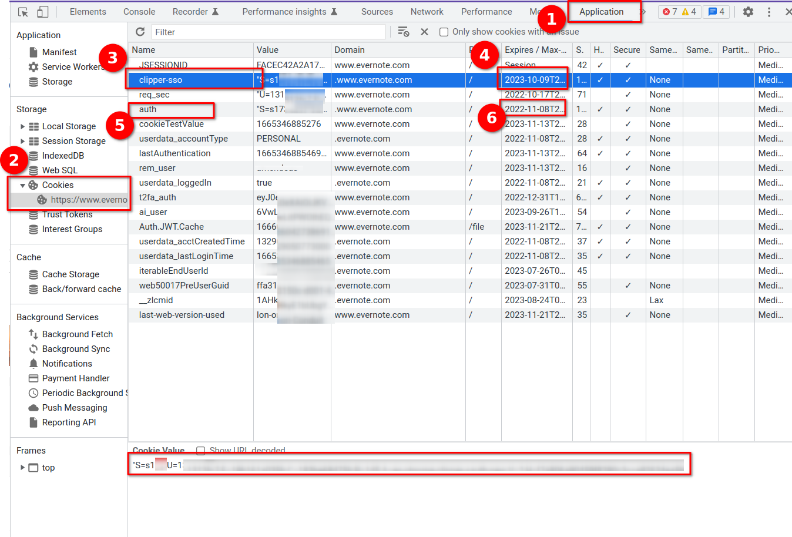

# Evernote Rsync

A simple java based programm to sync Evernote Attachments
with your local file system.

Currently only sync from Evernote to your local file system is supported.

## Disclaimer

I use this application for my personal purpose on a Unbuntu linux system
and I did not test it on other system.

Use with care and at your own risk.
This programm doesn't write (yet) to Evernote, but may
delete files on your local system if you use the `--delete` option.

I suggest to backup your local working directory, use `--dryRun` option
before every real run and use `--delete` option with care.

However, this programm is developed with best intentions in mind and I hope it's useful.

## Usage

You have to install Java (JRE oder JDK >= 17) to run this programm.

Currently, there is no standalone version of this application available.
This might change in the future.

Download the latest release from https://github.com/peterquiel/evernote-rsync/releases and
run the following command to see all available options:

[source, bash]
----
java -jar evernote-rsync-VERSION.jar --help
----

Output:
[source, bash]
----
Usage: Evernote Rsync [-hv] [--delete] [-dr] -t [--verbose]
                      [-d=<localDirectory>] [-es=<evernoteService>]
                      [-de=<excludeDelete>]... [-n=<notebooks>]...
                      [-s=<stacks>]... [@<filename>...]
      [@<filename>...]    One or more argument files containing options.
  -d, --directory=<localDirectory>
                          Local directory to sync to. Default is
                            current working directory
      -de, --delete-excludes=<excludeDelete>
                          Regular expression to exclude files or folders for
                            deletion.
      --delete            Delete empty local directories or local files not
                            found in Evernote. Default false.
      -dr, --dryRun       Dry Run: Log file operations instead of applying them.
      -es, --evernote-service=<evernoteService>
                          Evernote service to use. default is PRODUCTION;
                            possible values: PRODUCTION, SANDBOX, YINXIANG
  -h, --help              display this help message
  -n, --notebooks=<notebooks>
                          A list of Evernote notebook names its attachments
                            should be synced.
  -s, --stacks=<stacks>   A list of Evernote stack names its attachments should
                            be synced.
  -t, --token             Evernote access token; read readme in order to know
                            how to extract the token from web client login
                            process
  -v, --version           print version information and exit
      --verbose           detailed log output

----

### Token
The `token` is the most important option. Since, Evernote only supports OAuth 1.0
is almost impossible to provide a client side application with proper OAuth authorisation.

Furthermore, I depend on Evernote to enable Client-Id and Client-Secret on Production
and it looks like they ain't gone do it for a small client side application like this.

Therefore, you need to extract an authorization token from your Evernote Cookie.
Read the following section and learn how to do it.

### Multiple Parameters

The programm accepts `-n` or `--notebooks` and `-s` or `--stacks` parameters and one of these is required
and should be used to restrict to the list of notebooks its attachments you want to sync with
your local hard drive.

An option to sync all notebook attachments with your local drive is currently not
supported.

You can specify multiple notebooks or stacks with the following command:

[source, bash]
----
java -jar evernote-rsync-VERSION.jar -s "Stack One" -s "Stack Two" -n "Notebook One" -n "Notebook Two"
----

Analog the `--` parameter:
[source, bash]
----
java -jar evernote-rsync-VERSION.jar --stacks="Stack One" --stacks="Stack Two" --notebooks="Notebook One" --notebooks="Notebook Two"
----

### Option Files

It's a good idea to store your often used parameters like token in an parameters file.

You can simple do that by copying your parameters into the file and using these with:

[source, bash]
----
java -jar evernote-rsync-VERSION.jar @path/to/option/file_one @path/to/option/file_two
----

## Acquire Evernote Access Token

The authorization token is the most important parameters and grants access to
the Evernote API and your Evernote Notes.

Unfortunately, Evernote only supports OAuth 1.0 and not 2.0. This makes it almost impossible
to ship programms that run on clients, because an application needs a Client-Id and a Client-Secret
to authenticate itself. It's difficult (impossible?) to ship these credentials securely with an application.

Another problem: Evernote needs to approve the application and activate the Client-Id and Client-Secret on
their production system.

Therefore, we need to do a hack and extract an authentication token from your evernote cookie.

You need to do three things:

1. Log in into your evernote web account with your favorite browser.
2. Open the developer toolbars. On Chome it's `F12`
3. Follow the steps from this Chrome screenshot:

1. Select the Application tab
2. Open Cookies and select the evernote cookie
3. Click on `authn` (5.)or `clipper-sso` in the name column.
4. In `4.` and `6.` you see the expire date of the token. The `authn` token expires in a month and the `clipper-sso` token expires in a your. That token is used by the Evernote Webclipper and is only visible if you logged in via the Webclipper.
5. Copy the Cookie Value. That's token you need to pass to the program via the `-t` or `--token=` parameters.

**Attention**: Be aware that the token grants access to your personal Evernote account and you
should handle the token with care and as careful as you handle your login credentials.

## Build Project

The Program is developed with Java JDK 17 and you need to install
a JDK before you can build this project with the following command

A fatjar (jar with all dependencies build in)
can be build with:

[source, bash]
----
./gradlew fatjar
----

or

[source, bash]
----
./gradlew.bat fatjar
----
on Windows.

The fatjar can be found in `app/build/libs` folder.